# Docker

1. 容器与虚拟机比较  
1)虚拟机在本地系统看来只是一个文件，是主操作系统虚拟出来的从操作系统，一种带环境安装的解决方案，  虚拟一套硬件再运行一个完整操作系统，在该系统上再运行
进程缺点有三：资源占用多，启动慢，冗余步骤多  
2)Linux容器不是模拟一个完整的操作系统，而是对进程进行隔离  
Docker容器是在操作系统层面上实现虚拟化，直接复用本地主机的操作系统，Docker优势为启动快、占用体积小
没有进行硬件虚拟

#### Docker三要素
镜像(image)，容器(container)，仓库(repository)
###### 1.镜像
相当于java的类，是一个只读的模板，可以用来创建Docker容器，相当于一个root文件系统
###### 2.容器
相当于类的实例对象，用镜像创建的运行实例，每个容器都是相互隔离、保证安全的平台，可看成简易版的Linux环境
###### 3.仓库
相当于maven，集中存放镜像模板的地方

# Docker工作原理
Docker是一个Client-Server结构的系统，Docker守护进程运行在主机上，然后通过Socket连接从客户端访问
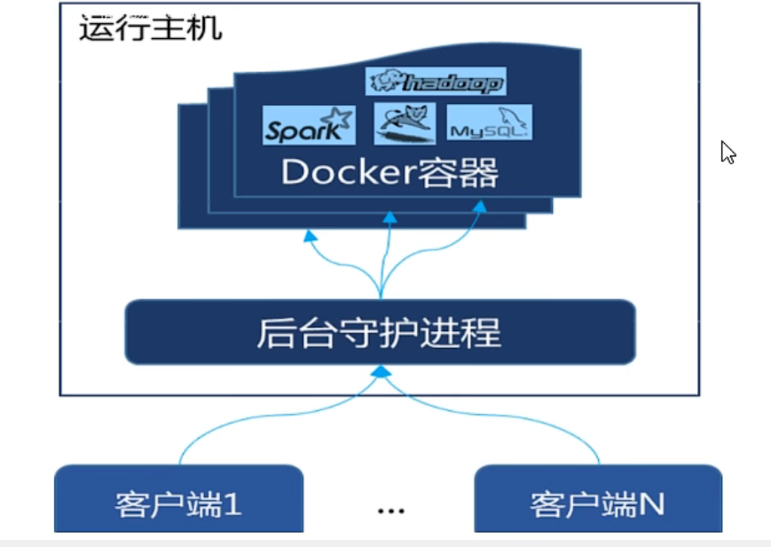


# Docker为什么比虚拟机快
1.docker有比虚拟机更少的抽象层，不需要硬件资源初始化
2.docker利用的是宿主机的内核，而不需要重新加载操作系统OS内核

# Docker命令

**Docker启动命令**
`````
systemctl start docker
`````
---
**Docker基本命令**
````
启动docker: systemctl start docker  
停止docker: systemctl stop docker  
重启docker: systemctl restart docker  
查看docker状态: systemctl status docker  
开机启动docker: systemctl enable docker  
查看docker概要信息: docker info  
查看docker总体帮助文档: docker --help  
查看docker命令帮助文档: docker 具体命令 --help  
````
---
**镜像命令**
查看主机上的镜像: ```docker images```  
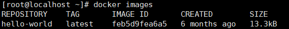  
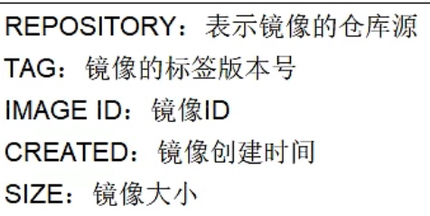  
同一仓库源可以有多个TAG版本,如果  不指定的话默认是用最新的  
````
docker search 镜像名  ： 查看官网的镜像   后面加 --limit N，可以只列出N个  
docker pull 镜像名字(:TAG)不指定TAG的话那就是下载最新版,可以用来下载镜像  
docker system df 可以查看docker空间  
docker rmi -f 镜像名/镜像ID 强制删除镜像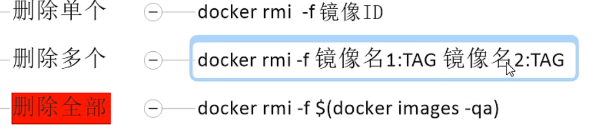
````
面试题：docker虚悬镜像是什么？  
仓库名、标签都是<none>的镜像，俗称虚悬镜像dangling image
---
**Docker容器命令**  
1.启动容器
````
docker run [OPTIONS] IMAGE [COMMAND] [ARG...]
````
[OPTIONS]:

```
--name="容器名字" :指定容器新名称
-d: 后台运行
-i: 以交互模式启动容器，通常与-t同时使用
-t: 为容器重新分配一个伪输入终端，通常与-i同时使用
-P: 随机端口映射
-p: 指定端口映射  
```
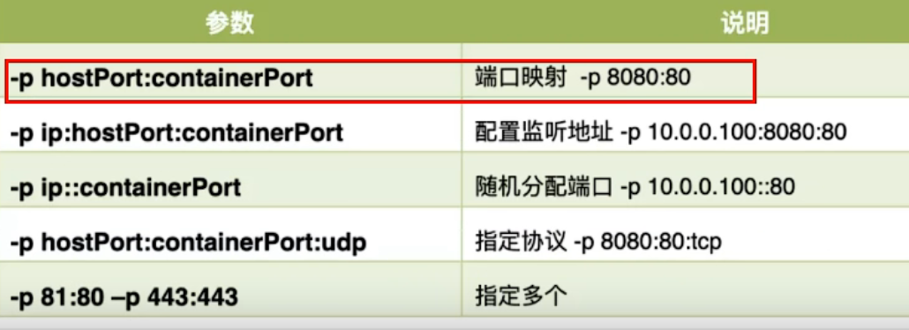

例子: 以交互模式启动一个容器
```
docker run -it centos:centos7 /bin/bash
```
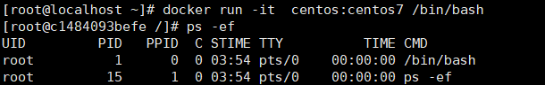  
2.查看当前正在运行的容器
```
新开一个终端然后输入
docker ps 
```
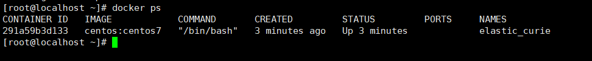  
docker ps [OPTIONS]说明(常用)  
```
-a :列出当前所有运行的＋历史上运行过的  
-l :显示最近创建的容器  
-n :显示最近n个创建的容器  
-q :静默模式，只显示容器编号  
```
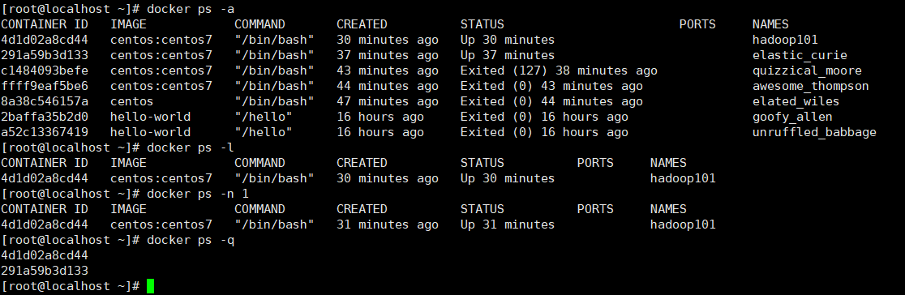  
3.进入容器后退出容器  
* ```exit```，容器停止 
* ctrl + p + q,退出容器后，容器不停止  

4.其他容器操作
```
启动已停止运行的容器 docker start 容器ID/容器名
重启容器 docker restart 容器ID/容器名
停止容器 docker stop 容器ID/容器名
强制停止容器 docker kill 容器ID/容器名
删除已停止的容器 docker rm  容器ID
强制删除 docker rm -f 容器ID
```
5.重要  
1) 启动守护式容器(后台服务器)  docker run -d 容器名  
大多数情况下我们都希望docker的服务是在后台运行的，不过一旦用后台，他前台没有，docker会觉得他没事情干就自杀了，直接就退出了
 所以我们还是以前台进入命令行告诉docker这个容器我们还在使用   
* 下面以redis来演示前后台  
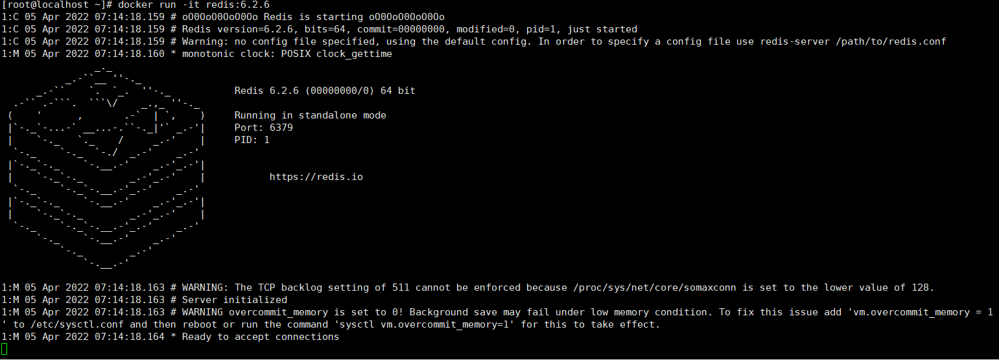  
当然我们平常redis都是后台启动的，所以下面演示后台守护启动   
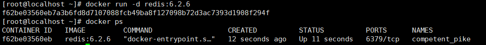  

---
2) 浏览容器的日志信息
```
docker logs 容器id
```
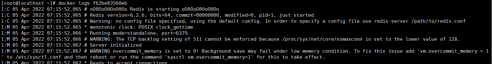  

---
3) 查看容器细节
```
docker inspect 容器ID
```
包含大量的json串    
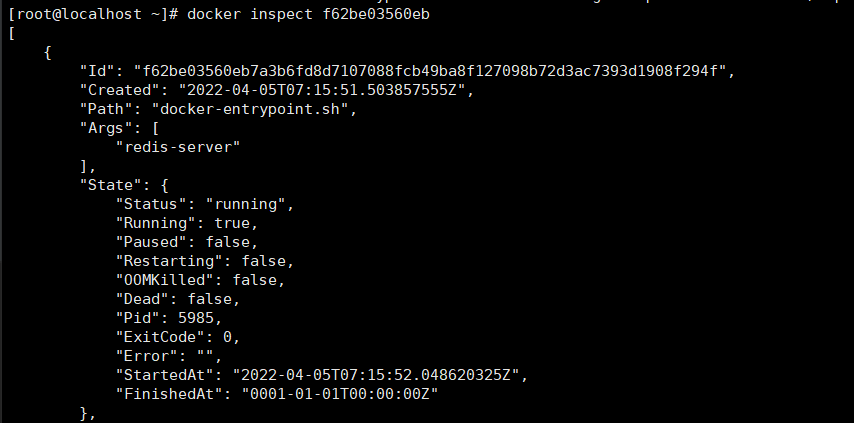  
**每一个容器**都是一个简易微小的Linux  

---
4) 进入正在运行的容器
```
docker run -it centos:centos7 /bin/bash
然后ctrl + p + q退出容器但是不停止容器的运行
```
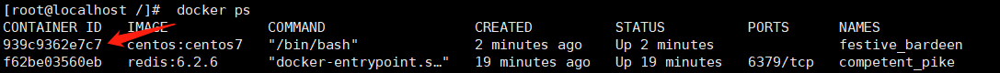  
接着如果我们要进入这个容器输入:  
``docker exec -it 容器ID/容器名 /bin/bash``  
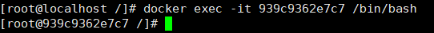  
exec是在容器中打开新的终端，并且可以启动新的进程，用exit退出，不会导致容器的停止

还有一个指令可以进入正在运行的容器
``docker attach 容器ID``
attach直接进入终端，不会启动新的进程，用exit退出，容器停止   
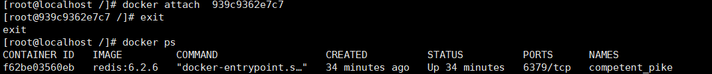  
**平常工作中用exec进入容器，这样退出后后续的人也能进入使用**

---
5) 进入之前后台运行的redis容器  
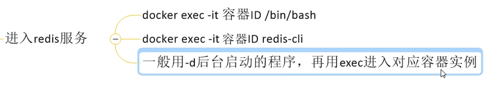  
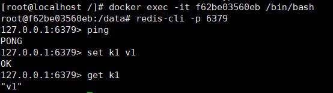  

---
6) 从容器内把文件发送到主机上  
``docker cp 容器ID:容器内路径 目的主机路径`` 把指定容器内的a.txt文件发到主机上  
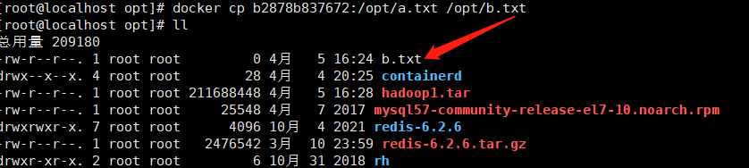  
---
7) **导入和导出容器**  容器搬楼操作，很常用很重要  
```导入容器的指令 cat 文件名.tar | docker import - 镜像用户/镜像名:镜像版本号```  
```导出容器的指令 docker export 容器ID > 文件名.tar```  
测试：  
我在容器内创建一个叫a.txt的文件，然后退出容器，docker export 导出容器成tar包，之后删除该容器  
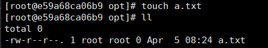  
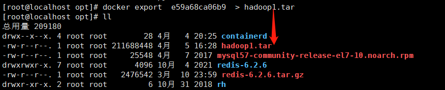  
导入容器后发现a.txt还在，证明这个就是之前的容器  
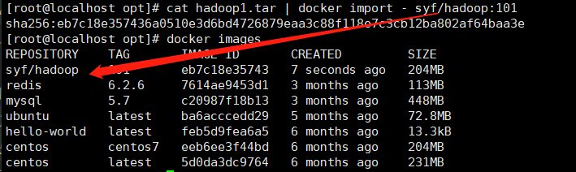  
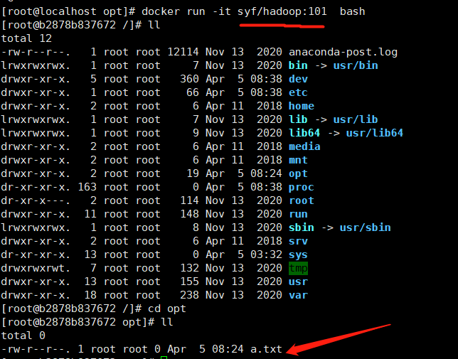  
---
# Docker 镜像
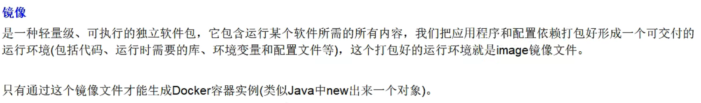  
1.镜像的分层概念  
以pull为例，下载的时候是一层一层下载的  
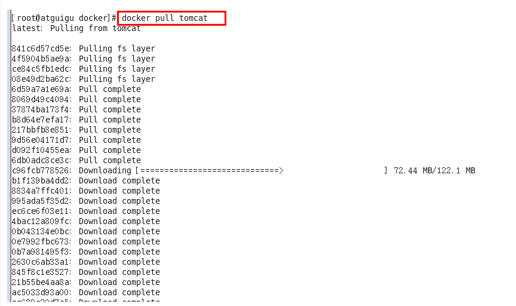  
---
**UnionFS（联合文件系统）：**  
Union文件系统（UnionFS）是一种分层、轻量级并且高性能的文件系统，它支持对文件系统的修改作为一次提交来一层层的叠加，同时可以将不同目录挂载到同一个虚拟文件系统下(unite several directories into a single virtual filesystem)。Union 文件系统是 Docker 镜像的基础。镜像可以通过分层来进行继承，基于基础镜像（没有父镜像），可以制作各种具体的应用镜像。
特性：一次同时加载多个文件系统，但从外面看起来，只能看到一个文件系统，联合加载会把各层文件系统叠加起来，这样最终的文件系统会包含所有底层的文件和目录
---
**Docker镜像加载原理:**  
docker的镜像实际上由一层一层的文件系统组成，这种层级的文件系统UnionFS。
bootfs(boot file system)主要包含bootloader和kernel, bootloader主要是引导加载kernel, Linux刚启动时会加载bootfs文件系统，在Docker镜像的最底层是引导文件系统bootfs。这一层与我们典型的Linux/Unix系统是一样的，包含boot加载器和内核。当boot加载完成之后整个内核就都在内存中了，此时内存的使用权已由bootfs转交给内核，此时系统也会卸载bootfs。

rootfs (root file system) ，在bootfs之上。包含的就是典型 Linux 系统中的 /dev, /proc, /bin, /etc 等标准目录和文件。rootfs就是各种不同的操作系统发行版，比如Ubuntu，Centos等等。
。
平时我们安装进虚拟机的CentOS都是好几个G，为什么docker这里才200M？？

对于一个精简的OS，rootfs可以很小，只需要包括最基本的命令、工具和程序库就可以了，因为底层直接用Host的kernel，自己只需要提供 rootfs 就行了。由此可见对于不同的linux发行版, bootfs基本是一致的, rootfs会有差别, 因此不同的发行版可以公用bootfs。

Docker为什么要用这种分层结构  
镜像分层最大的一个好处就是共享资源，方便复制迁移，就是为了复用。

比如说有多个镜像都从相同的 base 镜像构建而来，那么 Docker Host 只需在磁盘上保存一份 base 镜像；
同时内存中也只需加载一份 base 镜像，就可以为所有容器服务了。而且镜像的每一层都可以被共享。
---
**重点理解**  
Docker镜像层都是只读的，容器层是可写的
当容器启动时，一个新的可写层被加载到镜像的顶部。
这一层通常被称作“容器层”，“容器层”之下的都叫“镜像层”。  
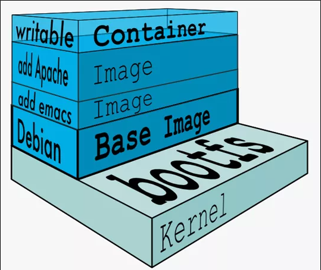  