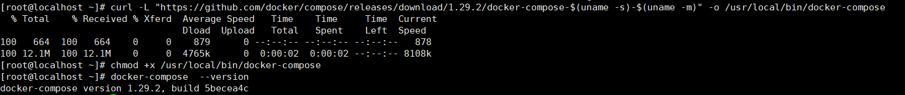

# compose
###简介
Docker-Compose是Docker官方的开源项目，    
负责实现对Docker容器集群的快速编排。   
### 用途  
Compose允许用户通过一个单独的docker-compose.yml模板文件（YAML 格式）来定义一组相关联的应用容器为一个项目（project）。   

### 安装Docker compose
```
curl -L "https://github.com/docker/compose/releases/download/1.29.2/docker-compose-$(uname -s)-$(uname -m)" -o /usr/local/bin/docker-compose    
chmod +x /usr/local/bin/docker-compose  
docker-compose --version  
```
    


### Compose核心概念   
####  一文件
docker-compose.yml    

#### 两要素
###### 1.服务service      
一个个应用容器实例，比如订单微服务、库存微服务、mysql容器、nginx容器或者redis容器      
###### 2.工程project
由一组关联的应用容器组成的一个完整业务单元，在 docker-compose.yml 文件中定义。     


### Compose使用  
1.编写docker-compose.yml 文件  

下面以使用一个springboot项目jar包，mysql，redis为例  
```
version: "3"
services:
  microService:
    image: zzyy_docker:1.6
    container_name: ms01
    ports:
      - "6001:6001"
    volumes:
      - /app/microService:/data
    networks: 
      - atguigu_net 
    depends_on: 
      - redis
      - mysql
  redis:
    image: redis:6.0.8
    ports:
      - "6379:6379"
    volumes:
      - /app/redis/redis.conf:/etc/redis/redis.conf
      - /app/redis/data:/data
    networks: 
      - atguigu_net
    command: redis-server /etc/redis/redis.conf
  mysql:
    image: mysql:5.7
    environment:
      MYSQL_ROOT_PASSWORD: '123456'
      MYSQL_ALLOW_EMPTY_PASSWORD: 'no'
      MYSQL_DATABASE: 'db2021'
      MYSQL_USER: 'zzyy'
      MYSQL_PASSWORD: 'zzyy123'
    ports:
       - "3306:3306"
    volumes:
       - /app/mysql/db:/var/lib/mysql
       - /app/mysql/conf/my.cnf:/etc/my.cnf
       - /app/mysql/init:/docker-entrypoint-initdb.d
    networks:
      - atguigu_net
    command: --default-authentication-plugin=mysql_native_password #解决外部无法访问
networks: 
   atguigu_net: 
```

2. 执行docker-compose up -d


### Compose 常用命令   
```
docker-compose -h                           # 查看帮助
docker-compose up                           # 启动所有docker-compose服务
docker-compose up -d                        # 启动所有docker-compose服务并后台运行
docker-compose down                         # 停止并删除容器、网络、卷、镜像。
docker-compose exec  yml里面的服务id                 # 进入容器实例内部  docker-compose exec docker-compose.yml文件中写的服务id /bin/bash
docker-compose ps                      # 展示当前docker-compose编排过的运行的所有容器
docker-compose top                     # 展示当前docker-compose编排过的容器进程
docker-compose logs  yml里面的服务id     # 查看容器输出日志
dokcer-compose config     # 检查配置
dokcer-compose config -q  # 检查配置，有问题才有输出
docker-compose restart   # 重启服务
docker-compose start     # 启动服务
docker-compose stop      # 停止服务
```