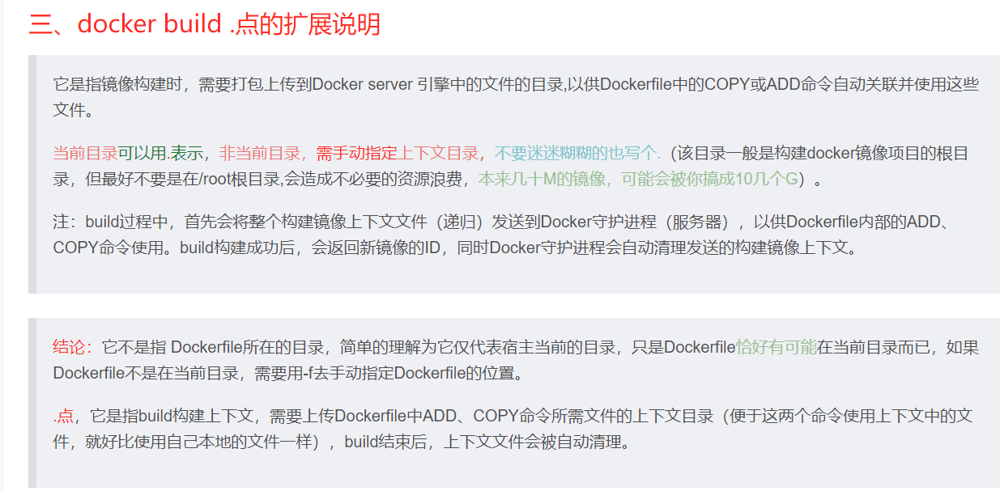
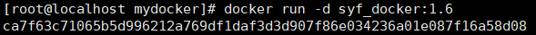

# DockerFile
Dockerfile是用来构建Docker镜像的文本文件，是由一条条构建镜像所需的指令和参数构成的脚本。  
###### 三步骤  
编写Dockerfile文件->docker build命令构建镜像->docker run 镜像容器实例   
###### 基础知识  
1. 每条保留字指令都必须为大写字母且后面要跟随至少一个参数
2. 指令从上到下顺序执行
3. #表示注释 
4. 每条指令都会创建一个新的镜像层并对镜像进行提交  


# DockerFile常用保留字指令  
  


#  案例  
让centos7内包含vim，jdk8，ifconfig    
1. 新建myfile文件夹,将jdk的Linux安装包传入    
``
mkdir /myfile
``
  

2. vim Dockerfile   **D大写**  
```
FROM centos:7
MAINTAINER syf
ENV MYPATH /usr/local
WORKDIR $MYPATH
#安装vim编辑器
RUN yum -y install vim
#安装ifconfig命令查看网络IP
RUN yum -y install net-tools
#安装java8及lib库
RUN yum -y install glibc.i686
RUN mkdir /usr/local/java
#ADD 是相对路径jar,把jdk-8u171-linux-x64.tar.gz添加到容器中,安装包必须要和Dockerfile文件在同一位置
ADD jdk-8u171-linux-x64.tar.gz /usr/local/java/
#配置java环境变量
ENV JAVA_HOME /usr/local/java/jdk1.8.0_171
ENV JRE_HOME $JAVA_HOME/jre
ENV CLASSPATH $JAVA_HOME/lib/dt.jar:$JAVA_HOME/lib/tools.jar:$JRE_HOME/lib:$CLASSPATH
ENV PATH $JAVA_HOME/bin:$PATH
EXPOSE 80
CMD echo $MYPATH
CMD echo "success--------------ok"
CMD /bin/bash
```  

3. 构建docker build -t  新镜像名字:TAG . 
**TAG后面有个 空格加点 **  
  
```
docker bulid -t centos7java8:1.5 .
```
  
  

4. 运行镜像    
   
会发现初始目录是 local，也就是我们Dockerfile  ENV MYPATH  然后WORKDIR $MYPATH 设置的初始工作路径  
5. 验证  
  

##### 上述案例回顾了docker可以通过分层来进行继承，一层层叠加，基于基础就镜像(不是父镜像！！！)，可以制作各种镜像
# 虚悬镜像(dangling image)  
仓库名和标签都是<none>的镜像  
面试题:请你说说什么是虚悬镜像  
是平常构建或者删除镜像时候出现错误导致仓库和标签都是<none>  
查看虚悬镜像的命令  
``docker image ls -f dangling=true``   

   
 删除虚悬镜像的命令  
 ``docker image prune``  

# Docker微服务实战  
1. 通过IDEA新建一个普通微服务模块,用maven打包成jar包然后上传到Linux   
  
  
  

2. 通过dockerfile发布微服务部署到docker容器     
最好在当前路径下vim   Dockerfile   
   
``docker build -t syf_docker:1.6 .``  
-t是取名字的标签  
详情访问[Docker官网](https://docs.docker.com/engine/reference/commandline/build/)  
3. 建造容器  
     
4. 启动容器  
   
  
5. 测试微服务容器   


