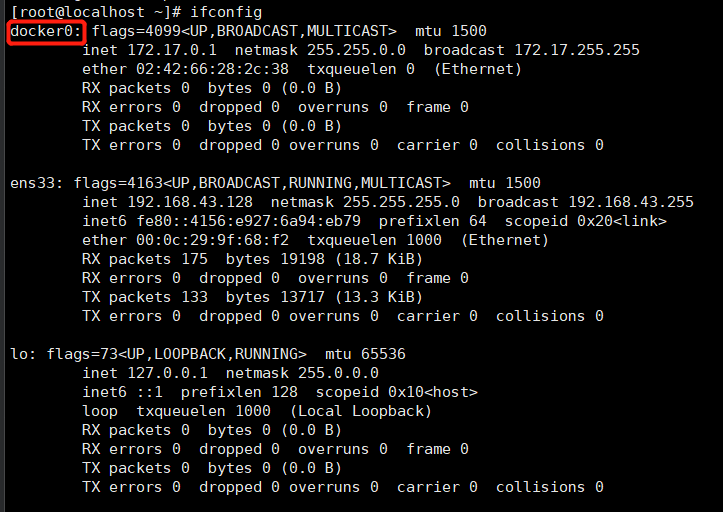
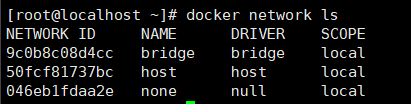
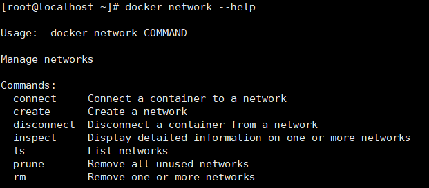
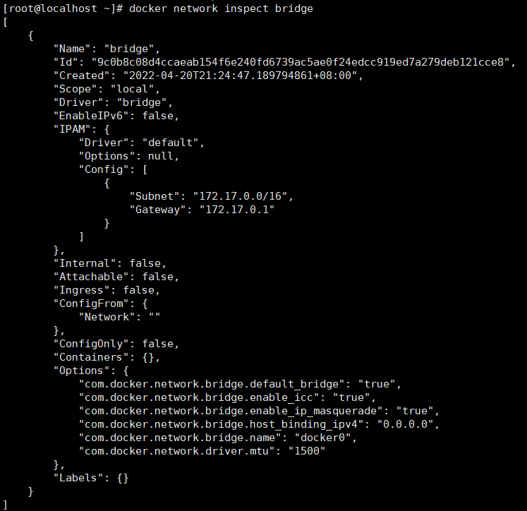

# docker network
    
### docker启动后，网络情况  
``docker network ls``  
     
默认创建三大网络模式  

### docker network常用基本命令    
   
将容器连接到网络     
创建一个网络    
断开容器与网络的连接    
查询网络数据源信息   
    
展示网络列表    
删除所有未使用的网络    
删除一个或多个网络   
### network能干什么  
1. 容器间的互联和通信以及端口映射  
2. 容器ip变动时候可以通过服务名直接网络通信而不受影响  

### docker network网络模式有哪些  
1. bridge(虚拟网桥，默认为该模式)       
为每一个容器分配、设置ip等，并将容器连接到一个docker0   
2. host：容器将不会虚拟出自己的网卡，配置自己的IP等，而是使用宿主机的IP和端口    
3. none：容器有独立的network namespace，但并没有对其进行任何网络配置  
4. container：新创建的容器不会创建自己的网卡和配置自己的IP，而是和一个指定的容器共享IP、端口范围等，类似看同桌的书本   

### docker容器内部的ip是有可能会变化的      

## bridge
Docker服务默认会创建一个docker网桥(名字为docker0)，它在内核层连通了其他的物理和虚拟网卡  
