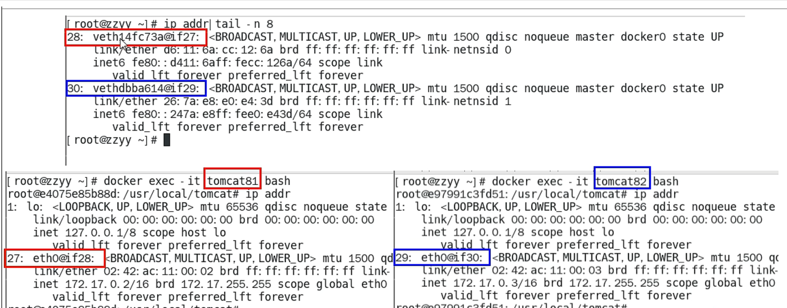
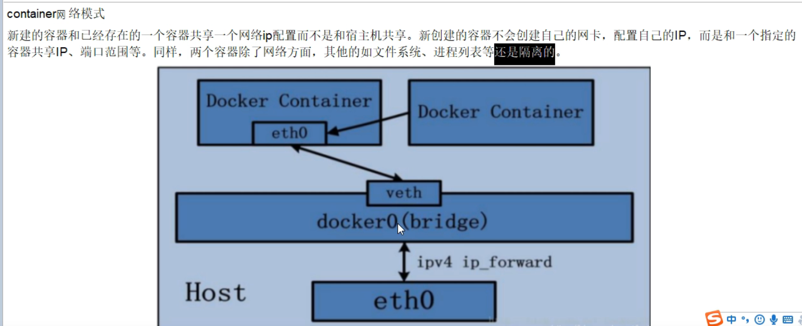

# docker network
    
### docker启动后，网络情况  
``docker network ls``  
     
默认创建三大网络模式  

### docker network常用基本命令    
   
将容器连接到网络     
创建一个网络    
断开容器与网络的连接    
查询网络数据源信息   
    
展示网络列表    
删除所有未使用的网络    
删除一个或多个网络   
### network能干什么  
1. 容器间的互联和通信以及端口映射  
2. 容器ip变动时候可以通过服务名直接网络通信而不受影响  

### docker network网络模式有哪些  
1. bridge(虚拟网桥，默认为该模式)       
为每一个容器分配、设置ip等，并将容器连接到一个docker0   
2. host：容器将不会虚拟出自己的网卡，配置自己的IP等，而是使用宿主机的IP和端口    
3. none：容器有独立的network namespace，但并没有对其进行任何网络配置  
4. container：新创建的容器不会创建自己的网卡和配置自己的IP，而是和一个指定的容器共享IP、端口范围等，类似看同桌的书本   

### docker容器内部的ip是有可能会变化的      

## bridge(98%都是在用这个)
Docker服务默认会创建一个docker网桥(名字为docker0)，它在内核层连通了其他的物理或虚拟网卡，这就将所有容器和本地主机都放到同一个物理网络。  
Docker默认制定了docker0接口的IP地址和子网掩码，让主机和容器之间可以通过网桥相互通信    
   
ip addr查看ip     
  
   
1.  Docker使用Linux桥接，在宿主机虚拟一个Docker容器网桥(docker0)，Docker启动一个容器时会根据Docker网桥的网段分配给容器一个IP地址，称为Container-IP，同时Docker网桥是每个容器的默认网关。因为在同一宿主机内的容器都接入同一个网桥，这样容器之间就能够通过容器的Container-IP直接通信。  
2.  docker run 的时候，没有指定network的话默认使用的网桥模式就是bridge，使用的就是docker0。在宿主机ifconfig,就可以看到docker0和自己create的network(后面讲)eth0，eth1，eth2……代表网卡一，网卡二，网卡三……，lo代表127.0.0.1，即localhost，inet addr用来表示网卡的IP地址  
3.  网桥docker0创建一对对等虚拟设备接口一个叫veth，另一个叫eth0，成对匹配。  
 * 整个宿主机的网桥模式都是docker0，类似一个交换机有一堆接口，每个接口叫veth，在本地主机和容器内分别创建一个虚拟接口，并让他们彼此联通（这样一对接口叫veth pair）；   
 * 每个容器实例内部也有一块网卡，每个接口叫eth0；   
 * docker0上面的每个veth匹配某个容器实例内部的eth0，两两配对，一一匹配。   
通过上述，将宿主机上的所有容器都连接到这个内部网络上，两个容器在同一个网络下,会从这个网关下各自拿到分配的ip，此时两个容器的网络是互通的。   
      
 

## host
直接使用宿主机的 IP 地址与外界进行通信，不再需要额外进行NAT 转换。   
    

## none
只有lo标识，就是127.0.0.1表示本地回环  

## container

   

   

# 自定义网络   
1. 创建一个网桥  docker network create  网络名    
  
2. 新建容器加入上一步新建的自定义网络   
   
3，结论:自定义网络本身就维护好了主机名和ip的对应关系(ip和域名都能通)

