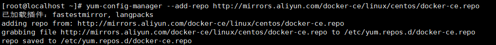
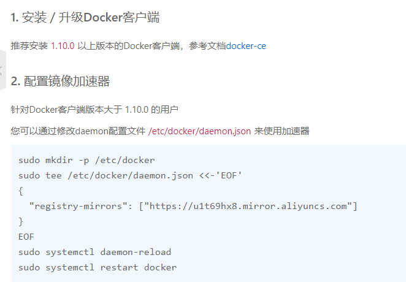

#### 1.卸载之前的版本
```
yum remove docker \  
docker-client \  
docker-client-latest \
docker-common \
docker-latest \
docker-latest-logrotate \
docker-logrotate \
docker-engine
```
#### 2.yum安装gcc相关  
1.yum -y install gcc   
2.yum -y install gcc-c++  

#### 3.配置镜像仓库  
1.yum install -y yum-utils  
2. 用阿里云的镜像    
``
yum-config-manager --add-repo http://mirrors.aliyun.com/docker-ce/linux/centos/docker-ce.repo   
``
  
3.让yum安装快一些 
yum makecache fast  

#### 4.安装docker引擎  
yum install docker-ce docker-ce-cli containerd.io  

#### 5.配置阿里云镜像加速
``
sudo mkdir -p /etc/docker
sudo tee /etc/docker/daemon.json <<-'EOF'
{
"registry-mirrors": ["https://u1t69hx8.mirror.aliyuncs.com"]
}
EOF
sudo systemctl daemon-reload
sudo systemctl restart docker
``  
