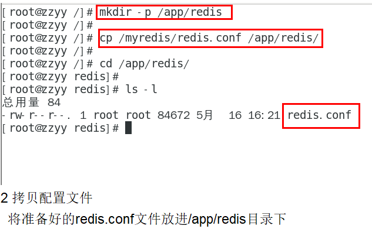

# 1.安装Mysql  
####### 指令，必须映射容器卷，不然退出容器数据都没了，是绝对不行的
```
docker run -d -p 3306:3306 --privileged=true -v /syf/mysql/log:/var/log/mysql -v /syf/mysql/data:/var/lib/mysql -v /syf/mysql/conf:/etc/mysql/conf.d -e MYSQL_ROOT_PASSWORD=123456 --name mysql mysql:5.7  
```
  

重新启动
```
docker exec -it  mysql /bin/bash
```
###注意事项
###### 如果run的时候出现端口被占用(宿主机运行了MySQL)，则按以下方式解决:    
```
netstat -tanlp 找出占用3306端口的线程，接着kill 线程
```


###### 解决MySQL中文乱码问题
``Docker MySQL默认的字符集编码是拉丁,MySQL插入中文会乱码  ``  
1.新建my.cnf  
``
[client]  
default_character_set=utf8  
[mysqld]  
collation_server = utf8_general_ci  
character_set_server = utf8  
``  
  
修改完之后记得**重启**,然后就可以插入中文字符了  
重新查看字符集  ``SHOW VARIABLES LIKE 'character%';``  
  

  

## 2.安装redis  
1.步骤  
  
2.改配置文件  
* /app/redis目录下修改redis.conf文件
* 开启redis验证 
``requirepass 密码``
* 允许redis外地连接  必须注释掉 # bind 127.0.0.1  

* daemonize no
将daemonize yes注释起来或者 daemonize no设置，因为该配置和docker run中-d参数冲突，会导致容器一直启动失败  

* 开启redis数据持久化  
``appendonly yes  可选``  


3.运行容器  
``
docker run  -p 6379:6379 --name myr3 --privileged=true -v /app/redis/redis.conf:/etc/redis/redis.conf -v /app/redis/data:/data -d redis redis-server /etc/redis/redis.conf
``

4.进入redis客户端
``
docker exec -it  ID /bin/bash  
redis-cli  
``


