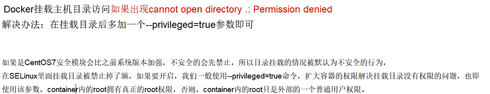
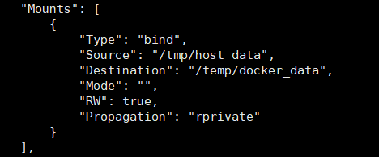
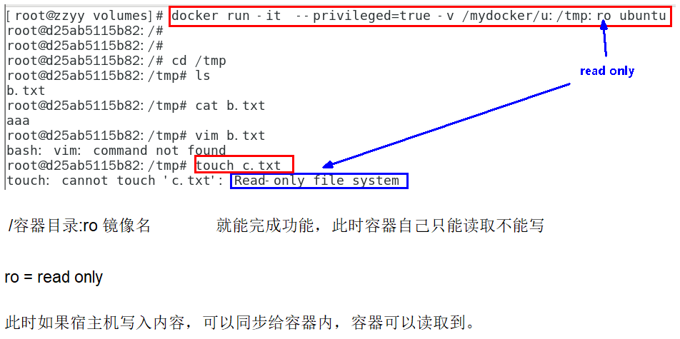
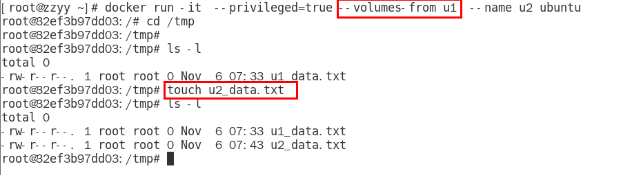

# 容器数据卷
**记得加上**下面这个参数  
``--privileged=true``  
原因如下:  
  

###### 容器数据卷的解释:
卷就是目录或文件，存在于一个或多个容器中，由docker挂载到容器，但不属于联合文件系统，因此能够绕过Union File System提供一些用于持续存储或共享数据的特性：
卷的设计目的就是数据的持久化，完全独立于容器的生存周期，因此Docker不会在容器删除时删除其挂载的数据卷  

###### 运行一个带有容器卷存储功能的容器实例
``docker run -it --privileged=true -v /宿主机绝对路径目录:/容器内目录      镜像名``

---
Docker容器产生的数据，如果不备份，那么当容器实例删除后，容器内的数据自然也就没有了。
为了能保存数据在docker中我们使用卷  
容器数据卷可以映射目录，持久化到主机目录上，将docker容器内的数据保存进宿主机的磁盘中，实现数据的持久化(类似redi的AOF和RDB持久化方式)  
特点：  
1.数据卷可在容器之间共享或重用数据  
2.卷中的更改可以直接实时生效，爽  
3.数据卷中的更改不会包含在镜像的更新中  
4.数据卷的生命周期一直持续到没有容器使用它为止  
###### 命令
``docker run -it -v /宿主机目录:/容器内目录 ubuntu /bin/bash``  
  

输入命令``docker inspect 容器ID``  
  
``Mounts挂载的意思 bind:绑定 Source宿主机下的源 Destination目的地:docker内的``  
**如果容器关了，然后在宿主机上这个目录进行了修改，当容器重新开机后，数据也会同步**  

###### 容器卷的读写规则映射  
1.容器实例的权限默认是读写  

2.也可以设置为只读  
  
###### 容器的继承
``docker run -it  --privileged=true --volumes-from 父类(c1)  --name c2 centos:centos7 /bin/bash``
  
c1挂了,c2依然有用,并不影响  
可以理解为一主二从

