# 构建私有库  
###### 1.下载镜像
``docker pull registry ``  

###### 2.运行私有库registry
``docker run -d -p 5000:5000  -v /zzyyuse/myregistry/:/tmp/registry --privileged=true registry``  
默认情况，仓库被创建在容器的/var/lib/registry目录下，建议自行用容器卷映射，方便于宿主机联调  
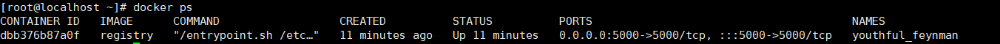
######  3.举例子:安装install命令
``yum install net-tools ``  
``
接着提交该拥有install命令的镜像
docker commit -m="提交的描述信息" -a="作者" 容器ID 要创建的镜像名:[标签名]
``
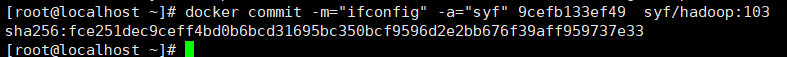  
然后我们启动新提交的镜像,有ifconfig功能     
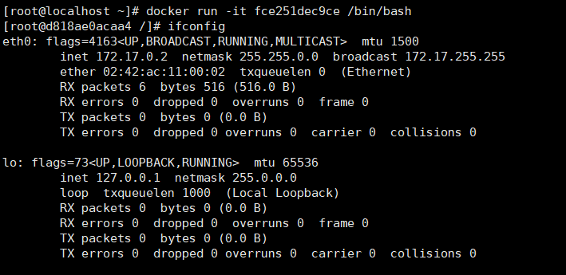

###### 4.发送curlGET请求，验证有什么镜像,发现是空的  
``curl -XGET http://192.168.133.130:5000/v2/_catalog``  
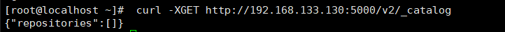

###### 5.将新镜像修改为符合私服规范的Tag  
按照公式： ``docker   tag   镜像:Tag   Host:Port/Repository:Tag``
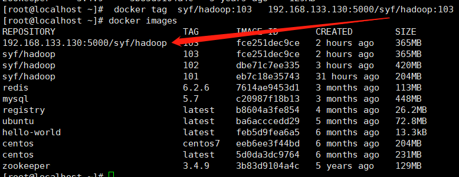
###### 6.修改配置文件使之支持http  
```"insecure-registries": ["192.168.133.130:5000"```  
第一条是之前安装的适合配置的阿里镜像加速器,现在添加指令告诉我们本机ip：5000这个端口是安全的,因为docker默认不允许http方式推送镜像    
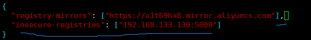  
**注意，json字符串之间用,连接不要忘记**  
修改完配置后以防万一，最好重启以下docker   
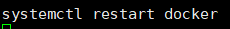
运行我们的私有仓库  
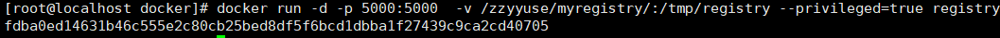  
###### 7.push推送到私有库 
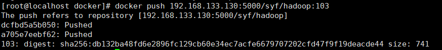
###### 8.验证仓库中是否有这个镜像  
``curl -XGET http://192.168.133.130:5000/v2/_catalog``  
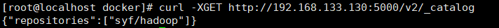  
###### 9.pull到本地并运行  
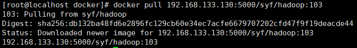  
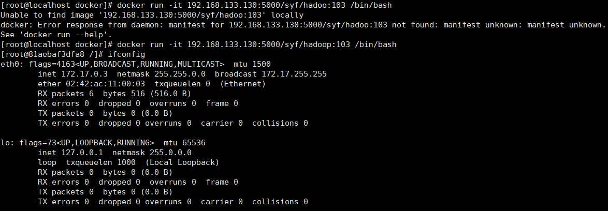