# Docker集群搭建  
# MySQL
1.搭建master机  
``
docker run -p 3307:3306 --name mysql-master \  
-v /mydata/mysql-master/log:/var/log/mysql \  
-v /mydata/mysql-master/data:/var/lib/mysql \  
-v /mydata/mysql-master/conf:/etc/mysql \
-e MYSQL_ROOT_PASSWORD=root  \
-d mysql:5.7
``

2.进入/mydata/mysql-master/conf目录下新建my.cnf配置文件   
```
[mysqld]
## 设置server_id，同一局域网中需要唯一
server_id=101 
## 指定不需要同步的数据库名称
binlog-ignore-db=mysql  
## 开启二进制日志功能
log-bin=mall-mysql-bin  
## 设置二进制日志使用内存大小（事务）
binlog_cache_size=1M  
## 设置使用的二进制日志格式（mixed,statement,row）
binlog_format=mixed  
## 二进制日志过期清理时间。默认值为0，表示不自动清理。
expire_logs_days=7  
## 跳过主从复制中遇到的所有错误或指定类型的错误，避免slave端复制中断。
## 如：1062错误是指一些主键重复，1032错误是因为主从数据库数据不一致
slave_skip_errors=1062
```
3. 修改完成后执行  
``docker restart mysql-master``

4. 进入容器  
``
   docker exec -it mysql-master /bin/bash  
   mysql -uroot -proot
``
5.创建同步对象   
``
CREATE USER 'slave'@'%' IDENTIFIED BY '123456';
GRANT REPLICATION SLAVE, REPLICATION CLIENT ON *.* TO 'slave'@'%';
``
5. 新建从服务器容器实例3308  
```
docker run -p 3308:3306 --name mysql-slave \
-v /mydata/mysql-slave/log:/var/log/mysql \
-v /mydata/mysql-slave/data:/var/lib/mysql \
-v /mydata/mysql-slave/conf:/etc/mysql \
-e MYSQL_ROOT_PASSWORD=root  \
-d mysql:5.7
```  
7. 进入/mydata/mysql-slave/conf目录下新建my.cnf   
```
[mysqld]
## 设置server_id，同一局域网中需要唯一
server_id=102
## 指定不需要同步的数据库名称
binlog-ignore-db=mysql
## 开启二进制日志功能，以备Slave作为其它数据库实例的Master时使用
log-bin=mall-mysql-slave1-bin
## 设置二进制日志使用内存大小（事务）
binlog_cache_size=1M
## 设置使用的二进制日志格式（mixed,statement,row）
binlog_format=mixed
## 二进制日志过期清理时间。默认值为0，表示不自动清理。
expire_logs_days=7
## 跳过主从复制中遇到的所有错误或指定类型的错误，避免slave端复制中断。
## 如：1062错误是指一些主键重复，1032错误是因为主从数据库数据不一致
slave_skip_errors=1062
## relay_log配置中继日志
relay_log=mall-mysql-relay-bin
## log_slave_updates表示slave将复制事件写进自己的二进制日志
log_slave_updates=1
## slave设置为只读（具有super权限的用户除外）
read_only=1
```

8. 修改完配置后重启slave实例   
 `` docker restart mysql-slave``   
9.在主数据库中查看主从同步状态   
``show master status;``  

10.从数据库操作  
* 进入容器
* 配置主从复制
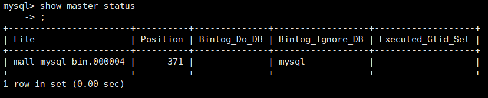
```mysql
change master to master_host='192.168.133.133', master_user='slave', master_password='root',master_port=3307, master_log_file='mall-mysql-bin.000004', master_log_pos=371, master_connect_retry=30;
```

````
  master_host：主数据库的IP地址；
  master_port：主数据库的运行端口；
  master_user：在主数据库创建的用于同步数据的用户账号；
  master_password：在主数据库创建的用于同步数据的用户密码；
  master_log_file：指定从数据库要复制数据的日志文件，通过查看主数据的状态，获取File参数；
  master_log_pos：指定从数据库从哪个位置开始复制数据，通过查看主数据的状态，获取Position参数；
  master_connect_retry：连接失败重试的时间间隔，单位为秒。  
````
* 查看主从同步状态  
``show slave status \G``  
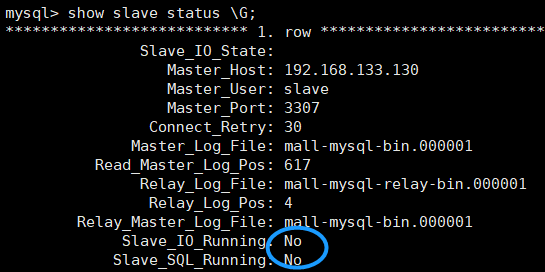  
主从同步还没开始
* 开启主从同步  
``start slave;``  
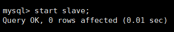  
* 查看从数据库状态发现已经同步  

11。主从复制测试  

# Redis     
#### 背景:1~2亿条数据需要缓存，请问如何设计这个存储实例  
#### 哈希槽分区分布式存储，搭建redis集群
#### 搭建3主3从集群  

1.关闭防火墙  

```
>>>关闭防火墙

systemctl stop firewalld.service            #停止firewall
systemctl disable firewalld.service        #禁止firewall开机启动

>>>开启端口

firewall-cmd --zone=public --add-port=80/tcp --permanent

命令含义

--zone #作用域
--add-port=80/tcp #添加端口，格式为：端口/通讯协议
--permanent #永久生效，没有此参数重启后失效

>>>重启防火墙

firewall-cmd --reload

其他常用命令：

 firewall-cmd --state                          ##查看防火墙状态，是否是running
firewall-cmd --reload                          ##重新载入配置，比如添加规则之后，需要执行此命令
firewall-cmd --get-zones                      ##列出支持的zone
firewall-cmd --get-services                    ##列出支持的服务，在列表中的服务是放行的
firewall-cmd --query-service ftp              ##查看ftp服务是否支持，返回yes或者no
firewall-cmd --add-service=ftp                ##临时开放ftp服务
firewall-cmd --add-service=ftp --permanent    ##永久开放ftp服务
firewall-cmd --remove-service=ftp --permanent  ##永久移除ftp服务
firewall-cmd --add-port=80/tcp --permanent    ##永久添加80端口 
iptables -L -n                                ##查看规则，这个命令是和iptables的相同的
man firewall-cmd                              ##查看帮助

更多命令，使用 firewall-cmd --help 查看帮助文件
```
2. 开启三主三从redis   
```
docker run -d --name redis-node-1 --net host --privileged=true -v /data/redis/share/redis-node-1:/data redis:6.2.6 --cluster-enabled yes --appendonly yes --port 6381
docker run -d --name redis-node-2 --net host --privileged=true -v /data/redis/share/redis-node-2:/data redis:6.2.6 --cluster-enabled yes --appendonly yes --port 6382
docker run -d --name redis-node-3 --net host --privileged=true -v /data/redis/share/redis-node-3:/data redis:6.2.6 --cluster-enabled yes --appendonly yes --port 6383
docker run -d --name redis-node-4 --net host --privileged=true -v /data/redis/share/redis-node-4:/data redis:6.2.6 --cluster-enabled yes --appendonly yes --port 6384
docker run -d --name redis-node-5 --net host --privileged=true -v /data/redis/share/redis-node-5:/data redis:6.2.6 --cluster-enabled yes --appendonly yes --port 6385
docker run -d --name redis-node-6 --net host --privileged=true -v /data/redis/share/redis-node-6:/data redis:6.2.6 --cluster-enabled yes --appendonly yes --port 6386
```
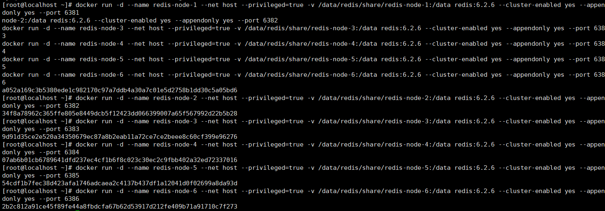    
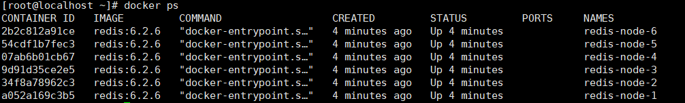  
 
 **解析**    
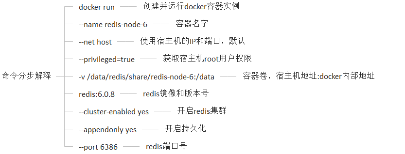  

3.  进入一台redis然后构建主从关系  
//注意，进入docker容器后才能执行一下命令，且注意自己的真实IP地址  
redis-cli --cluster create  192.168.43.128:6381  192.168.43.128:6382 192.168.43.128:6383 192.168.43.128:6384 192.168.43.128:6385 192.168.43.128:6386 --cluster-replicas 1  

--cluster-replicas 1 表示为每个master创建一个slave节点  

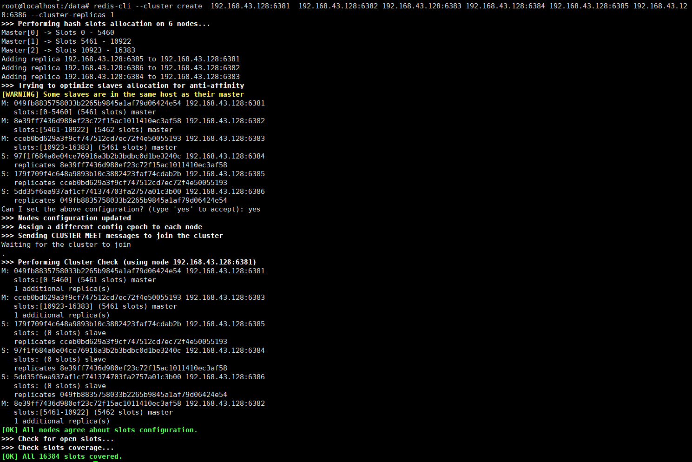  
4. 查看状态   
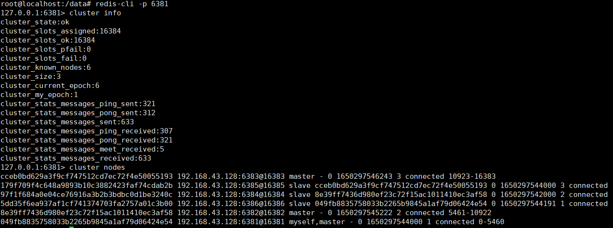  
#### 主从容错切换迁移案例 
#既然已经构建了集群了，就得用集群方式进入redis了, 因为已经分配了hash槽了，在单机中有些key-value存不进去 

``redis-cli -p 6381 -c  ``  
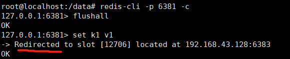  
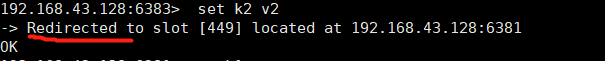  
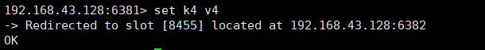  
 根据对应的卡槽插入对应的redis，然后跳转到对应的机器    
###### 检查集群状态指令 
redis-cli --cluster  check 192.168.43.128:6381  
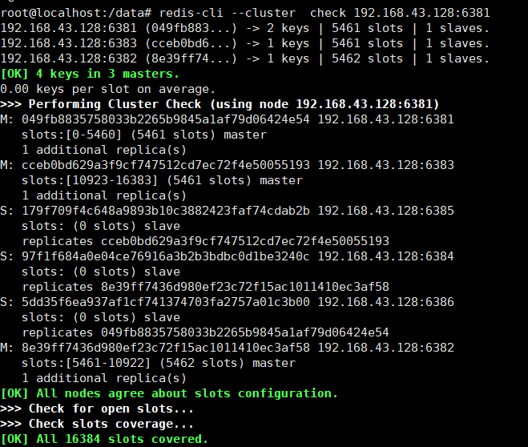   

#### 主从容错切换迁移 
我这里6381的从机slave是6386   
我们把6381停掉，看看6386是否上位   
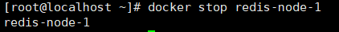  
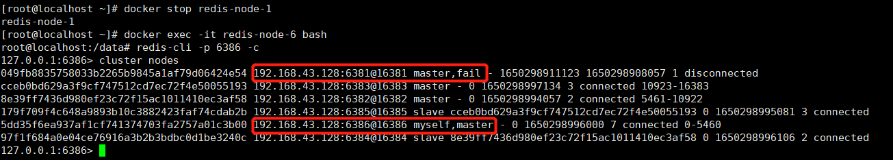  
如果6381重启了，那6381就是从机了，6386还是主机  
如果要切换回来6381和6386原来的主从关系就将上面的操作反过来就好了    

#### 主从扩容案例（使用量升高，不够用了要扩容）     
3主3从增加为4主4从  
1.  添加实例  
``
docker run -d --name redis-node-7 --net host --privileged=true -v /data/redis/share/redis-node-7:/data redis:6.2.6 --cluster-enabled yes --appendonly yes --port 6387
docker run -d --name redis-node-8 --net host --privileged=true -v /data/redis/share/redis-node-8:/data redis:6.2.6 --cluster-enabled yes --appendonly yes --port 6388
``    

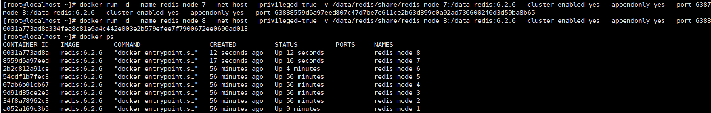       
**此时6387还没有分配槽号**    
2. 进入6387   
``redis-cli --cluster add-node 192.168.43.128:6387 192.168.43.128:6381``  
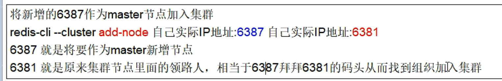              
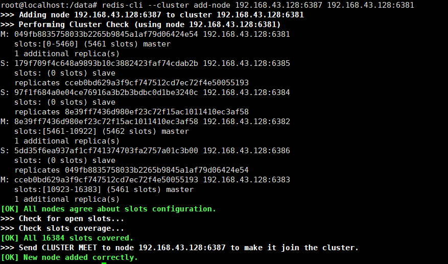  
3. 然后我们检查下状态，发现已经变成4主4从了    
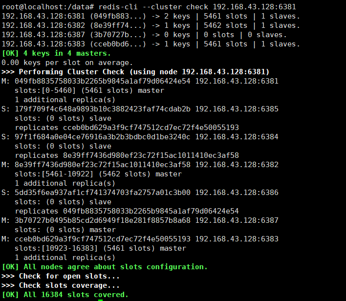    
4. 重新分配槽号  
``redis-cli --cluster reshard 192.168.43.128:6381``  
然后16384 / 4(台数)   = 4096  
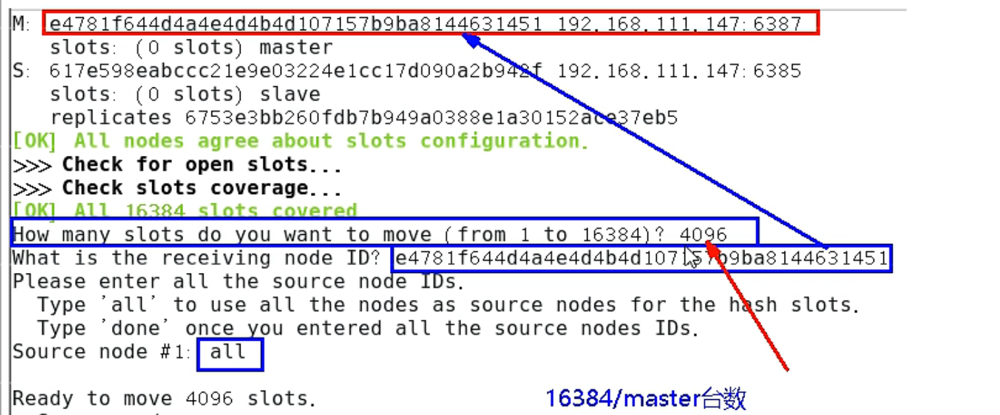    
5. **检查集群状态，发现是三个机器分别分了一些槽给6387(这个知识点很重要)**   
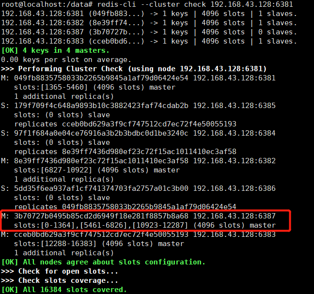  
6. 将从节点6388挂载到6387节点  
``
redis-cli --cluster add-node 192.168.43.128:6388 192.168.43.128:6387 --cluster-slave --cluster-master-id 3b70727b0495b85cd2d6949f18e281f8857b8a68     
最后的 master-id是6387的id
``  
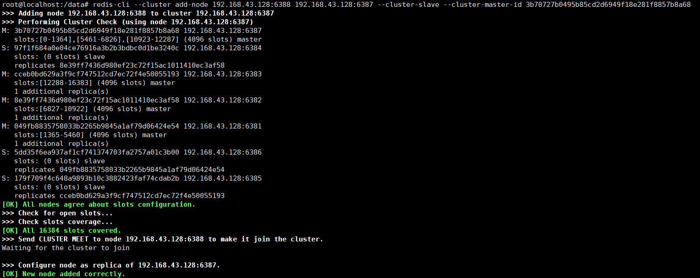  
7. 再次检查集群状态   
``redis-cli --cluster check 192.168.43.128:随便一个master节点的端口号``   
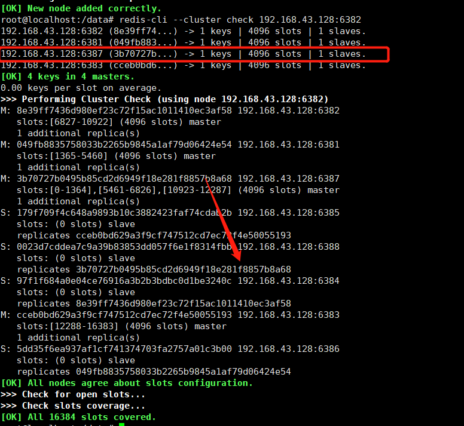   
 
   
#### 主从缩容案例  (峰值下去了，不用那么多redis了)
1. 先删除6388，因为6387是写主机，保险起见先删读从机6388  
查看6388id:  redis-cli --cluster check 192.168.43.128:6381  
命令：redis-cli --cluster del-node ip:从机端口 从机6388节点ID  
``redis-cli --cluster del-node 192.168.43.128:6388 0023d7cddea7c9a39b83853dd057f6e1f8314fbb``
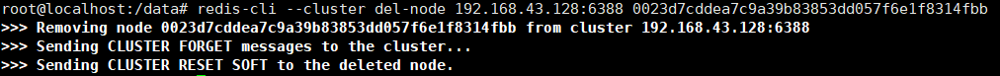   
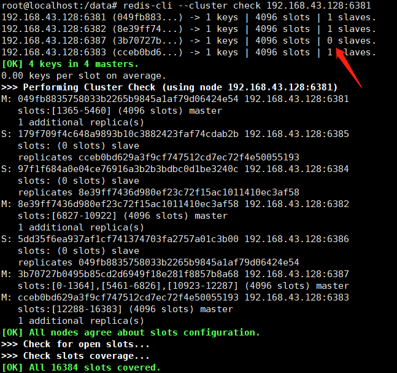  


2. 清出来的槽号重新分配（此例子直接把6387的槽号全部分配给6381了）  
``
   redis-cli --cluster reshard 192.168.43.128:6381
``
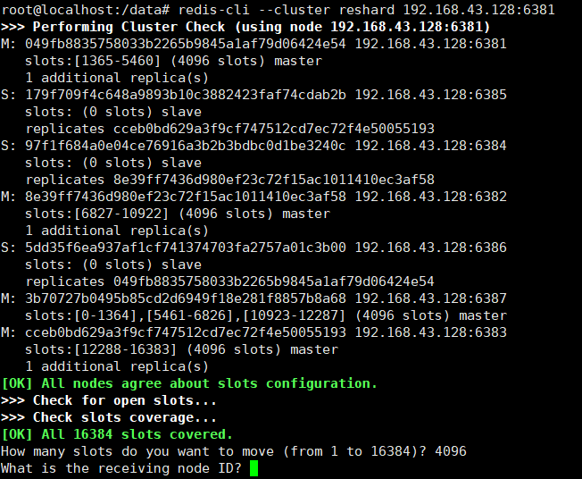  
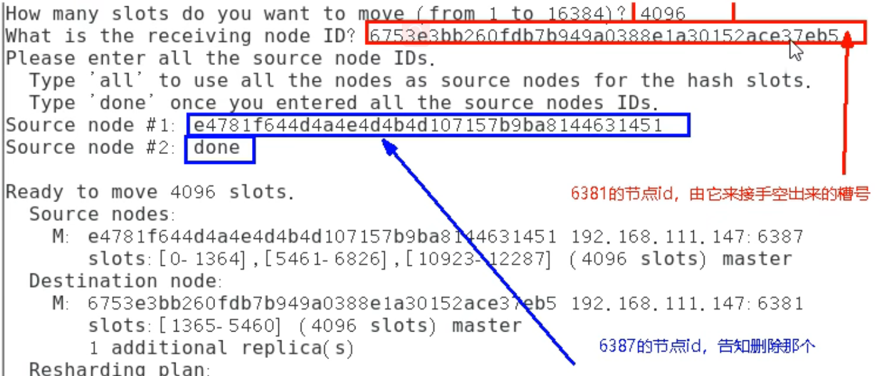   
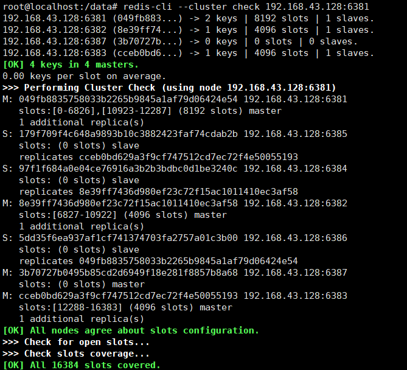   
可以看到6387的槽号全部分给6381了  
3. 再删除6387
``
命令：redis-cli --cluster del-node ip:端口 6387节点ID
redis-cli --cluster del-node 192.168.43.128:6387 3b70727b0495b85cd2d6949f18e281f8857b8a68
``  
4. 恢复成三主三从  
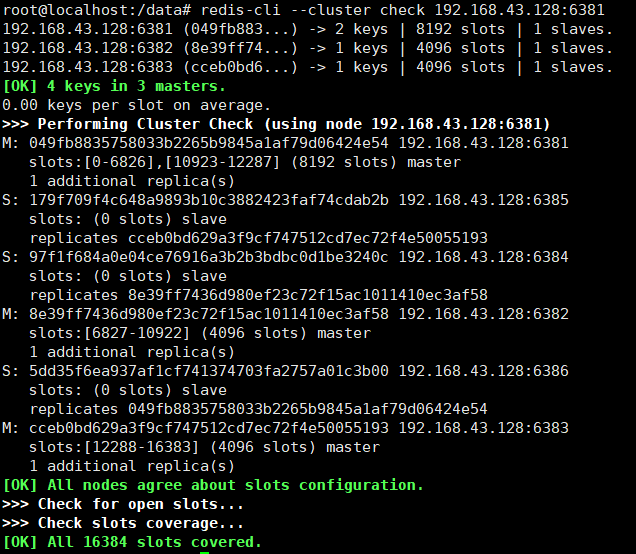  


